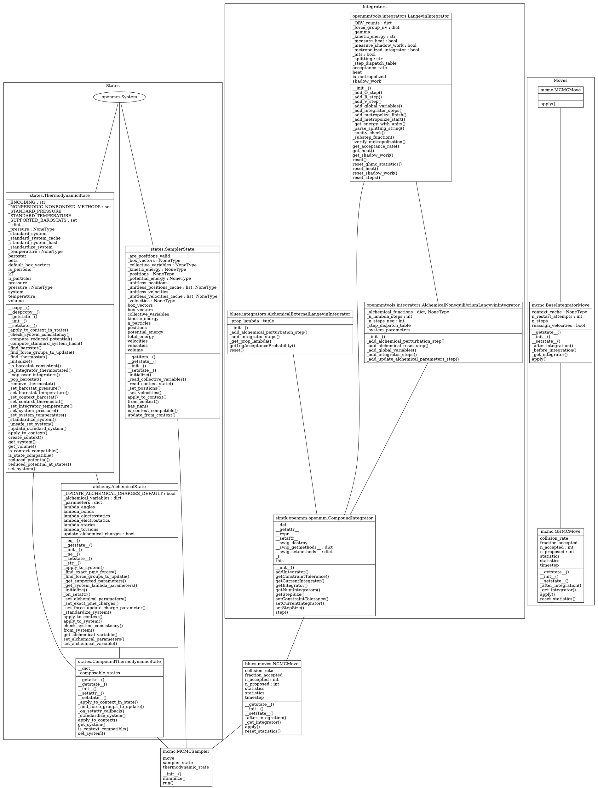

```dot
graph G {
    spline=0
    subgraph cluster_0 {
        label="States";
        Start -- ThermoState
        Start -- AlchemicalState
        Start -- SamplerState;
        ThermoState -- AlchemicalState
        ThermoState -- CompoundThermoState;
        AlchemicalState -- CompoundThermoState;
    }

    subgraph cluster_1 {
        label="Integrators";
        LangevinIntegrator -- CompoundIntegrator
        LangevinIntegrator -- AlchNCMCIntegrator
        AlchNCMCIntegrator -- CompoundIntegrator
        AlchExtIntegrator -- CompoundIntegrator
    }

    subgraph cluster_2 {
        label="Moves";
        MCMCMove -- BaseIntegratorMove
        BaseIntegratorMove -- GHMC
    }

    CompoundThermoState -- MCMCSampler
    SamplerState -- MCMCSampler
    CompoundIntegrator -- NCMCMove
    NCMCMove -- MCMCSampler

    "Start" [label="openmm.System"]
    "MCMCMove" [label="{mcmc.MCMCMove|\l|apply()\l}", shape="record"];
    "AlchExtIntegrator" [label="{blues.integrators.AlchemicalExternalLangevinIntegrator|_prop_lambda : tuple\l|__init__()\l_add_alchemical_perturbation_step()\l_add_integrator_steps()\l_get_prop_lambda()\lgetLogAcceptanceProbability()\lreset()\l}", shape="record"];

    "AlchNCMCIntegrator" [label="{openmmtools.integrators.AlchemicalNonequilibriumLangevinIntegrator|_alchemical_functions : dict, NoneType\l_n_lambda_steps : int\l_n_steps_neq : int\l_step_dispatch_table\l_system_parameters\l|__init__()\l_add_alchemical_perturbation_step()\l_add_alchemical_reset_step()\l_add_global_variables()\l_add_integrator_steps()\l_add_update_alchemical_parameters_step()\l}", shape="record"];

    "LangevinIntegrator" [label="{openmmtools.integrators.LangevinIntegrator|_ORV_counts : dict\l_force_group_nV : dict\l_gamma\l_kinetic_energy : str\l_measure_heat : bool\l_measure_shadow_work : bool\l_metropolized_integrator : bool\l_mts : bool\l_splitting : str\l_step_dispatch_table\lacceptance_rate\lheat\lis_metropolized\lshadow_work\l|__init__()\l_add_O_step()\l_add_R_step()\l_add_V_step()\l_add_global_variables()\l_add_integrator_steps()\l_add_metropolize_finish()\l_add_metropolize_start()\l_get_energy_with_units()\l_parse_splitting_string()\l_sanity_check()\l_substep_function()\l_verify_metropolization()\lget_acceptance_rate()\lget_heat()\lget_shadow_work()\lreset()\lreset_ghmc_statistics()\lreset_heat()\lreset_shadow_work()\lreset_steps()\l}", shape="record"];

    "CompoundIntegrator" [label="{simtk.openmm.openmm.CompoundIntegrator|__del__\l__getattr__\l__repr__\l__setattr__\l__swig_destroy__\l__swig_getmethods__ : dict\l__swig_setmethods__ : dict\l_s\lthis\l|__init__()\laddIntegrator()\lgetConstraintTolerance()\lgetCurrentIntegrator()\lgetIntegrator()\lgetNumIntegrators()\lgetStepSize()\lsetConstraintTolerance()\lsetCurrentIntegrator()\lsetStepSize()\lstep()\l}", shape="record"];

    "AlchemicalState" [shape="record",label="{alchemy.AlchemicalState|_UPDATE_ALCHEMICAL_CHARGES_DEFAULT : bool\l_alchemical_variables : dict\l_parameters : dict\llambda_angles\llambda_bonds\llambda_electrostatics\llambda_electrostatics\llambda_sterics\llambda_torsions\lupdate_alchemical_charges : bool\l|__eq__()\l__getstate__()\l__init__()\l__ne__()\l__setstate__()\l__str__()\l_apply_to_system()\l_find_exact_pme_forces()\l_find_force_groups_to_update()\l_get_supported_parameters()\l_get_system_lambda_parameters()\l_initialize()\l_on_setattr()\l_set_alchemical_parameters()\l_set_exact_pme_charges()\l_set_force_update_charge_parameter()\l_standardize_system()\lapply_to_context()\lapply_to_system()\lcheck_system_consistency()\lfrom_system()\lget_alchemical_variable()\lset_alchemical_parameters()\lset_alchemical_variable()\l}"];

    "SamplerState" [shape="record", label="{states.SamplerState|_are_positions_valid\l_box_vectors : NoneType\l_collective_variables : NoneType\l_kinetic_energy : NoneType\l_positions : NoneType\l_potential_energy : NoneType\l_unitless_positions\l_unitless_positions_cache : list, NoneType\l_unitless_velocities\l_unitless_velocities_cache : list, NoneType\l_velocities : NoneType\lbox_vectors\lbox_vectors\lcollective_variables\lkinetic_energy\ln_particles\lpositions\lpotential_energy\ltotal_energy\lvelocities\lvelocities\lvolume\l|__getitem__()\l__getstate__()\l__init__()\l__setstate__()\l_initialize()\l_read_collective_variables()\l_read_context_state()\l_set_positions()\l_set_velocities()\lapply_to_context()\lfrom_context()\lhas_nan()\lis_context_compatible()\lupdate_from_context()\l}"];

    "ThermoState" [shape="record",label="{states.ThermodynamicState|_ENCODING : str\l_NONPERIODIC_NONBONDED_METHODS : set\l_STANDARD_PRESSURE\l_STANDARD_TEMPERATURE\l_SUPPORTED_BAROSTATS : set\l__dict__\l_pressure : NoneType\l_standard_system\l_standard_system_cache\l_standard_system_hash\l_standardize_system\l_temperature : NoneType\lbarostat\lbeta\ldefault_box_vectors\lis_periodic\lkT\ln_particles\lpressure\lpressure : NoneType\lsystem\ltemperature\lvolume\l|__copy__()\l__deepcopy__()\l__getstate__()\l__init__()\l__setstate__()\l_apply_to_context_in_state()\l_check_system_consistency()\l_compute_reduced_potential()\l_compute_standard_system_hash()\l_find_barostat()\l_find_force_groups_to_update()\l_find_thermostat()\l_initialize()\l_is_barostat_consistent()\l_is_integrator_thermostated()\l_loop_over_integrators()\l_pop_barostat()\l_remove_thermostat()\l_set_barostat_pressure()\l_set_barostat_temperature()\l_set_context_barostat()\l_set_context_thermostat()\l_set_integrator_temperature()\l_set_system_pressure()\l_set_system_temperature()\l_standardize_system()\l_unsafe_set_system()\l_update_standard_system()\lapply_to_context()\lcreate_context()\lget_system()\lget_volume()\lis_context_compatible()\lis_state_compatible()\lreduced_potential()\lreduced_potential_at_states()\lset_system()\l}"];

    "CompoundThermoState" [shape="record", label="{states.CompoundThermodynamicState|__dict__\l_composable_states\l|__getattr__()\l__getstate__()\l__init__()\l__setattr__()\l__setstate__()\l_apply_to_context_in_state()\l_find_force_groups_to_update()\l_on_setattr_callback()\l_standardize_system()\lapply_to_context()\lget_system()\lis_context_compatible()\lset_system()\l}"];

    "BaseIntegratorMove" [label="{mcmc.BaseIntegratorMove|context_cache : NoneType\ln_restart_attempts : int\ln_steps\lreassign_velocities : bool\l|__getstate__()\l__init__()\l__setstate__()\l_after_integration()\l_before_integration()\l_get_integrator()\lapply()\l}", shape="record"];

    "GHMC" [label="{mcmc.GHMCMove|collision_rate\lfraction_accepted\ln_accepted : int\ln_proposed : int\lstatistics\lstatistics\ltimestep\l|__getstate__()\l__init__()\l__setstate__()\l_after_integration()\l_get_integrator()\lapply()\lreset_statistics()\l}", shape="record"];

    "NCMCMove" [label="{blues.moves.NCMCMove|collision_rate\lfraction_accepted\ln_accepted : int\ln_proposed : int\lstatistics\lstatistics\ltimestep\l|__getstate__()\l__init__()\l__setstate__()\l_after_integration()\l_get_integrator()\lapply()\lreset_statistics()\l}", shape="record"];

    "MCMCSampler" [label="{mcmc.MCMCSampler|move\lsampler_state\lthermodynamic_state\l|__init__()\lminimize()\lrun()\l}", shape="record"];
}
```
